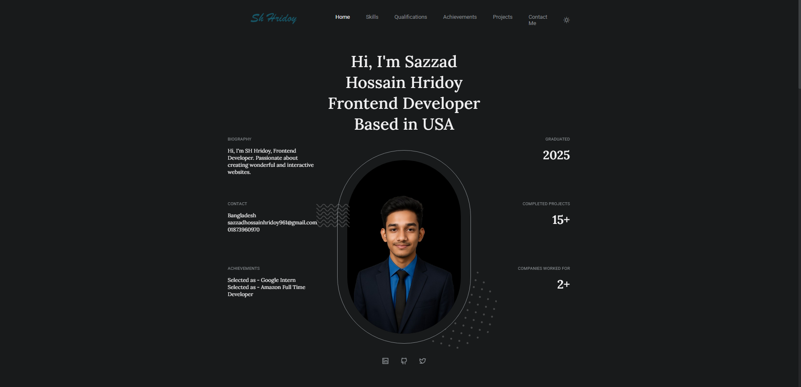
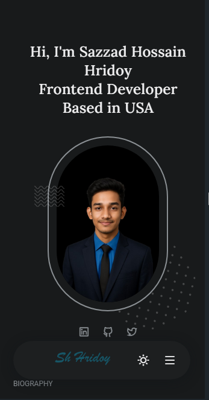

# 🌟 Personal Portfolio Website  

A modern and responsive **portfolio website** built using **HTML, Tailwind CSS, and JavaScript**.  
This portfolio highlights **skills, achievements, projects, and biography** in a professional way, perfect for showcasing personal brand and career journey.  

🌐 [Live Demo](https://sh-hridoy001.netlify.app/)  

---

## ✨ Features
- Responsive design, optimized for **desktop & mobile**.  
- Clean **dark theme** with modern UI.  
- Sections: Biography, Skills, Qualifications, Achievements, Projects, and Contact.  
- Interactive elements with smooth animations.  
- Easy to customize and extend.  

---

## 🖼️ Screenshots  

<div align="center">
  
  <br/><br/>
  
</div>  

---

## 🛠️ Technologies & Tools  

<div align="center">
  <br/>
</div>  

---

## 🚀 Usage Instructions  

1. Clone the repository:
   ```bash
   git clone https://github.com/sh-hridoy001/personal-portfolio.git
